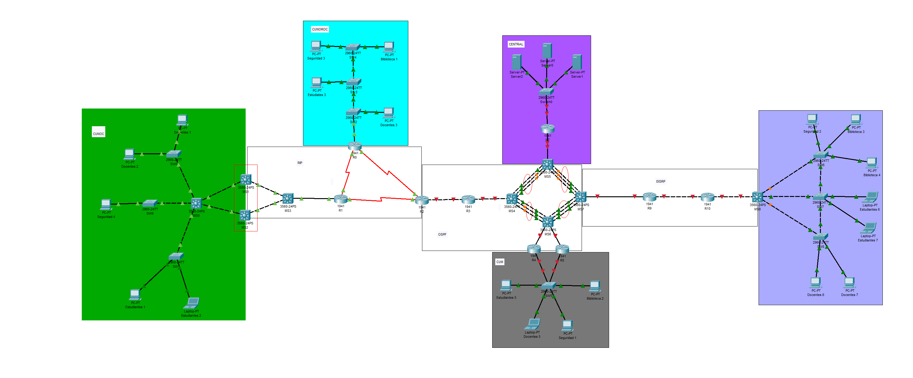
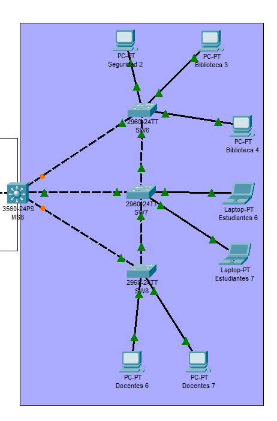
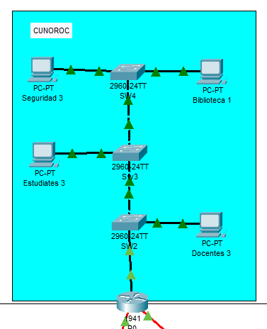
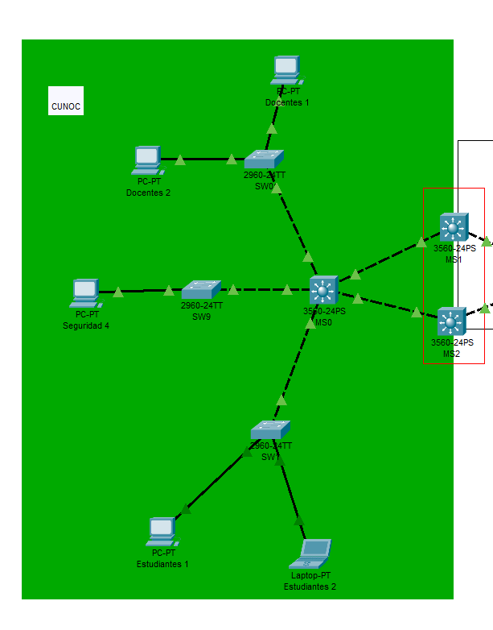
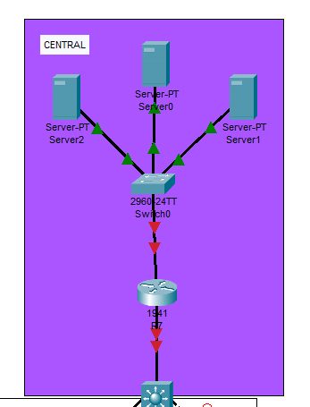
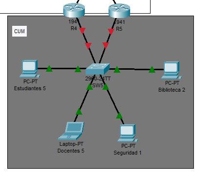

# **Documentación Proyecto2 en Packet Tracer**

## **1. Calculo de subnetting**

### **VLSM CUNDECH**

| **Subred**  | **No.hosts** | **IP de red**      | **Mascara**     | **Primer**     | **Ultimo**     | **Broadcast**  |
|-------------|--------------|--------------------|-----------------|----------------|----------------|----------------|
| Biblioteca  | 126          | 192.168.16.0 /25   | 255.255.255.128 | 192.168.16.1   | 192.168.16.126 | 192.168.16.127 |
| Estudiantes | 62           | 192.168.16.128 /26 | 255.255.255.192 | 192.168.16.129 | 192.168.16.190 | 192.168.16.191 |
| Docentes    | 30           | 192.168.16.192 /27 | 255.255.255.224 | 192.168.16.193 | 192.168.16.222 | 192.168.16.223 |
| Seguridad   | 6            | 192.168.16.224 /29 | 255.255.255.248 | 192.168.16.225 | 192.168.16.230 | 192.168.16.231 |

### **VLSM CUNOROC**

| **Subred**  | **No.hosts** | **IP de red**      | **Mascara**     | **Primer**     | **Ultimo**     | **Broadcast**  |
|-------------|--------------|--------------------|-----------------|----------------|----------------|----------------|
| Biblioteca  | 126          | 192.168.16.0 /25   | 255.255.255.128 | 192.168.16.1   | 192.168.16.126 | 192.168.16.127 |
| Estudiantes | 62           | 192.168.16.128 /26 | 255.255.255.192 | 192.168.16.129 | 192.168.16.190 | 192.168.16.191 |
| Docentes    | 30           | 192.168.16.192 /27 | 255.255.255.224 | 192.168.16.193 | 192.168.16.222 | 192.168.16.223 |
| Seguridad   | 14           | 192.168.16.224 /28 | 255.255.255.240 | 192.168.16.225 | 192.168.16.238 | 192.168.16.239 |

### **VLSM CUNOC**

| **Subred**  | **No.hosts** | **IP de red**      | **Mascara**     | **Primer**     | **Ultimo**     | **Broadcast**  |
|-------------|--------------|--------------------|-----------------|----------------|----------------|----------------|
| Biblioteca  | 62           | 172.16.16.0 /26    | 255.255.255.192 | 172.16.16.1    | 172.16.16.62   | 172.16.16.63   |
| Estudiantes | 62           | 172.16.16.64 /26   | 255.255.255.192 | 172.16.16.65   | 172.16.16.126  | 172.16.16.127  |
| Docentes    | 62           | 172.16.16.128 /26  | 255.255.255.192 | 172.16.16.129  | 172.16.16.190  | 172.16.16.191  |
| Seguridad   | 6            | 172.16.16.192 /29  | 255.255.255.248 | 172.16.16.193  | 172.16.16.198  | 172.16.16.199  |

### **VLSM CENTRAL** (sin terminar)

| **Subred**  | **No.hosts** | **IP de red**      | **Mascara**     | **Primer**     | **Ultimo**     | **Broadcast**  |
|-------------|--------------|--------------------|-----------------|----------------|----------------|----------------|
|             |              |                    |                 |                |                |                |
|             |              |                    |                 |                |                |                |
|             |              |                    |                 |                |                |                |
|             |              |                    |                 |                |                |                |

### **VLSM CUM** (sin terminar)

| **Subred**  | **No.hosts** | **IP de red**      | **Mascara**     | **Primer**     | **Ultimo**     | **Broadcast**  |
|-------------|--------------|--------------------|-----------------|----------------|----------------|----------------|
|             |              |                    |                 |                |                |                |
|             |              |                    |                 |                |                |                |
|             |              |                    |                 |                |                |                |
|             |              |                    |                 |                |                |                |

## **. Tabla de Direcciones IP** (sin terminar)

| **Vlan** | **Dispositivo** | **IP Asignada**    | **Default Gateway**  |
|----------|-----------------|--------------------|----------------------|
|  11      | Estudiante 7    | 192.168.16.136 /26 | 192.168.16.129       |
|  11      | Estudiante 6    | 192.168.16.135 /26 | 192.168.16.129       |
|  11      | Estudiante 5    |                    |                      |
|  11      | Estudiante 4    |                    |                      |
|  11      | Estudiante 3    | 192.168.16.132 /26 | 192.168.16.129       |
|  11      | Estudiante 2    | 172.16.16.67 /26   | 172.16.16.65         |
|  11      | Estudiante 1    | 172.16.16.66 /26   | 172.16.16.65         |
|  21      | Docente 7       | 192.168.16.200 /27 | 192.168.16.193       |
|  21      | Docente 6       | 192.168.16.199 /27 | 192.168.16.193       |
|  21      | Docente 5       |                    |                      |
|  21      | Docente 4       |                    |                      |
|  21      | Docente 3       | 192.168.16.196 /27 | 192.168.16.193       |
|  21      | Docente 2       | 172.16.16.131 /26  | 172.16.16.129        |
|  21      | Docente 1       | 172.16.16.130 /26  | 172.16.16.129        |
|  21      | Seguridad 4     | 172.16.16.194 /29  | 172.16.16.193        |
|  31      | Seguridad 3     | 192.168.16.228 /28 | 192.168.16.225       |
|  31      | Seguridad 2     | 192.168.16.227 /29 | 192.168.16.225       |
|  31      | Seguridad 1     |                    |                      |
|  41      | Biblioteca 4    | 192.168.16.5 /25   | 192.168.16.1         |
|  41      | Biblioteca 3    | 192.168.16.4 /25   | 192.168.16.1         |
|  41      | Biblioteca 2    |                    |                      |
|  41      | Biblioteca 1    | 192.168.16.2 /25   | 192.168.16.1         |

## **. Capturas de la implementación de las topologías**

### Topologia completa



### CUNDECH



### CUNOROC



### CUNOC



### CENTRAL



### CUM



## **. Configuración de los Switches (script)** (sin terminar)

### **R0**

```bash
ena
config t
hostname R0

router rip
version 2
no auto-summary
network 172.16.21.0
network 172.16.22.0
network 172.16.16.0
network 192.168.16.0

interface GigabitEthernet0/0.11
encapsulation dot1Q 11
ip address 192.168.16.129 255.255.255.192
no shutdown

interface GigabitEthernet0/0.21
encapsulation dot1Q 21
ip address 192.168.16.193 255.255.255.224
no shutdown

interface GigabitEthernet0/0.31
encapsulation dot1Q 31
ip address 192.168.16.225 255.255.255.240
no shutdown

interface GigabitEthernet0/0.41
encapsulation dot1Q 41
ip address 192.168.16.1 255.255.255.128
no shutdown

interface GigabitEthernet0/0
no shutdown

interface Serial0/1/0
ip address 172.16.21.2 255.255.255.252
no shutdown

interface Serial0/1/1
ip address 172.16.22.2 255.255.255.252
no shutdown
end

wr

```

### **R1**

```bash
ena
config t
hostname R1

router rip
version 2
no auto-summary
network 10.0.3.0
network 172.16.21.0

interface gig0/0
ip address 10.0.3.2 255.255.255.252
no shutdown

interface Serial0/1/1
ip address 172.16.21.1 255.255.255.252
clock rate 64000
no shutdown

interface serial0/1/0
ip address 172.16.31.1 255.255.255.252
no shutdown
end

wr
```

### **R2**

```bash
ena
config t
hostname R2

interface serial0/1/0
ip address 172.16.31.2 255.255.255.252
no shutdown

interface serial0/1/1
ip address 172.16.22.1 255.255.255.252
no shutdown
exit

router rip
version 2
no auto-summary
network 172.16.31.0
network 172.16.22.0
exit

router ospf 1
redistribute rip subnets
end

wr
```

### **MS0**

```bash
ena
config t
hostname MS0

vtp domain Grupo16
vtp password usac2025
vtp mode server

vlan 11
name Estudiantes

vlan 21
name Docentes

vlan 31
name Seguridad

vlan 41
name Biblioteca

interface range Fa0/1-5
switchport trunk encapsulation dot1q
switchport mode trunk
switchport trunk allowed vlan all
end

wr
```

### **MS1**

```bash
ena
config t
hostname MS1

vtp mode client
vtp version 2
vtp domain Grupo16
vtp password usac2025

ip routing

router rip
version 2
no auto-summary
network 172.16.16.0
network 10.0.1.0

interface vlan 11
ip address 172.16.16.126 255.255.255.192
standby 11 ip 172.16.16.65
standby 11 priority 110
standby 11 preempt
no shutdown

interface vlan 21
ip address 172.16.16.190 255.255.255.192
standby 21 ip 172.16.16.129
standby 21 priority 110
standby 21 preempt
no shutdown

interface vlan 31
ip address 172.16.16.198 255.255.255.248
standby 31 ip 172.16.16.193
standby 31 priority 110
standby 31 preempt
no shutdown

interface vlan 41
ip address 172.16.16.62 255.255.255.192
standby 41 ip 172.16.16.1
standby 41 priority 110
standby 41 preempt
no shutdown

interface Fa0/1
switchport trunk encapsulation dot1q
switchport mode trunk
switchport trunk allowed vlan all

interface Fa0/2
no switchport
ip address 10.0.1.1 255.255.255.252
no shutdown
end

wr
```

### **MS2**

```bash
ena
config t
hostname MS2

vtp mode client
vtp version 2
vtp domain Grupo16
vtp password usac2025

ip routing

router rip
version 2
no auto-summary
network 172.16.16.0
network 10.0.2.0

interface vlan 11
ip address 172.16.16.125 255.255.255.192
standby 11 ip 172.16.16.65
standby 11 priority 100
standby 11 preempt
no shutdown

interface vlan 21
ip address 172.16.16.189 255.255.255.192
standby 21 ip 172.16.16.129
standby 21 priority 100
standby 21 preempt
no shutdown

interface vlan 31
ip address 172.16.16.197 255.255.255.248
standby 31 ip 172.16.16.193
standby 31 priority 100
standby 31 preempt
no shutdown

interface vlan 41
ip address 172.16.16.61 255.255.255.192
standby 41 ip 172.16.16.1
standby 41 priority 100
standby 41 preempt
no shutdown

interface Fa0/1
switchport trunk encapsulation dot1q
switchport mode trunk
switchport trunk allowed vlan all

interface Fa0/2
no switchport
ip address 10.0.2.1 255.255.255.252
no shutdown
end

wr
```

### **MS3**

```bash
ena
config t
hostname MS3

ip routing

router rip
version 2
no auto-summary
network 10.0.1.0
network 10.0.2.0
network 10.0.3.0

interface fa0/1
no switchport
ip address 10.0.1.2 255.255.255.252
no shutdown

interface fa0/2
no switchport
ip address 10.0.2.2 255.255.255.252
no shutdown

interface fa0/3
no switchport
ip address 10.0.3.1 255.255.255.252
no shutdown
end

wr
```

### **MS8**

```bash
enable
config t
Hostname MS8

vtp mode client
vtp version 2
vtp domain Grupo16
vtp password usac2025

ip routing

interface vlan 11
ip address 192.168.16.129 255.255.255.192
no shutdown

interface vlan 21
ip address 192.168.16.193 255.255.255.224
no shutdown

interface vlan 31
ip address 192.168.16.225 255.255.255.248
no shutdown

interface vlan 41
ip address 192.168.16.1 255.255.255.128
no shutdown

interface range Fa0/2-4
switchport trunk encapsulation dot1q
switchport mode trunk
switchport trunk allowed vlan all 
exit

exit
wr
```

### **SW0**

```bash
ena
config t
hostname SW0

vtp domain Grupo16
vtp password usac2025
vtp mode client

interface Fa0/1
switchport mode trunk
exit

interface range Fa0/11-12
switchport mode acces
switchport access vlan 21
end

wr
```

### **SW1**

```bash
ena
config t
hostname SW1

vtp domain Grupo16
vtp password usac2025
vtp mode client

interface Fa0/1
switchport mode trunk
exit

interface range Fa0/11-12
switchport mode acces
switchport access vlan 11
end

wr
```

### **SW2**

```bash
ena
config t
hostname SW2

vtp domain Grupo16
vtp password usac2025
vtp mode client

interface range Fa0/1-2
switchport mode trunk
exit

interface Fa0/11
switchport mode acces
switchport access vlan 21
exit

exit
wr
```

### **SW3**

```bash
ena
config t
hostname SW3

vtp domain Grupo16
vtp password usac2025
vtp mode server

vlan 11
name Estudiantes

vlan 21
name Docentes

vlan 31
name Seguridad

vlan 41
name Biblioteca

interface range Fa0/1-2
switchport mode trunk
exit

interface Fa0/11
switchport mode acces
switchport access vlan 11
exit

exit
wr
```

### **SW4**

```bash
ena
config t
hostname SW4

vtp domain Grupo16
vtp password usac2025
vtp mode client

interface Fa0/1
switchport mode trunk
exit

interface Fa0/11
switchport mode acces
switchport access vlan 31
exit

interface Fa0/12
switchport mode acces
switchport access vlan 41
exit

exit
wr
```

### **SW6**

```bash
ena
config t
hostname SW6

vtp mode client
vtp version 2
vtp domain Grupo16
vtp password usac2025

interface range Fa0/1-2
switchport mode trunk
exit

interface Fa0/11
switchport mode acces
switchport access vlan 31
exit
interface range Fa0/12-13
switchport mode acces
switchport access vlan 41
exit

exit
wr
```

### **SW7**

```bash
ena
config t
hostname SW7

vtp domain Grupo16
vtp password usac2025
vtp mode server

vlan 11
name Estudiantes

vlan 21
name Docentes

vlan 31
name Seguridad

vlan 41
name Biblioteca

interface range Fa0/1-3
switchport mode trunk
exit

interface range Fa0/11-12
switchport mode acces
switchport access vlan 11
exit

exit
wr
```

### **SW8**

```bash
ena
config t
hostname SW8

vtp domain Grupo16
vtp password usac2025
vtp mode client

interface range Fa0/2-3
switchport mode trunk
exit

interface range Fa0/11-12
switchport mode acces
switchport access vlan 21
exit

exit
wr
```

### **SW9**

```bash
ena
config t
hostname SW9

vtp domain Grupo16
vtp password usac2025
vtp mode client

interface Fa0/1
switchport mode trunk
exit

interface Fa0/11
switchport mode acces
switchport access vlan 31
end

wr
```

### **R7**

```bash
ena
config t
hostname R7

interface GigabitEthernet0/0.51
encapsulation dot1q 51
ip address 192.120.16.51 255.255.255.0
no shutdown
exit

interface GigabitEthernet0/0.61
encapsulation dot1q 61
ip address 192.121.16.61 255.255.255.0
no shutdown
exit

interface GigabitEthernet0/0.71
encapsulation dot1q 71
ip address 192.122.16.71 255.255.255.0
no shutdown
exit

interface GigabitEthernet0/0
no shutdown
exit

exit
write memory

```
### **SW0**

```bash
ena
config t
hostname SW0

vtp domain Grupo16
vtp password usac2025
vtp mode transparent
exit

configure terminal
vlan 51
name VLAN51
exit
vlan 61
name VLAN61
exit
vlan 71
name VLAN71
exit
exit

interface fastEthernet 0/1 
switchport mode trunk
switchport trunk allowed vlan 51,61,71
exit

interface fastEthernet 0/2  
switchport mode access
switchport access vlan 71

interface fastEthernet 0/3  
switchport mode access
switchport access vlan 51

interface fastEthernet 0/4  
switchport mode access
switchport access vlan 61

exit
write memory


```

### **R4**

```bash
ena
config t
hostname R4

int g0/0
ip add 192.158.16.2 255.255.255.0
no sh

standby version 2
standby 2 ip 192.158.16.1
standby 2 priority 150
standby 2 preempt
exit


interface GigabitEthernet0/0.41
encapsulation dot1q 41
ip address 192.158.16.4 255.255.255.128
no shutdown
exit

interface GigabitEthernet0/0.11
encapsulation dot1q 11
ip address 192.158.16.129 255.255.255.192
no shutdown
exit

interface GigabitEthernet0/0.21
encapsulation dot1q 21
ip address 192.158.16.193 255.255.255.224
no shutdown
exit

interface GigabitEthernet0/0.31
encapsulation dot1q 31
ip address 192.158.16.225 255.255.255.240
no shutdown
exit

interface GigabitEthernet0/1
no shutdown
exit

exit
write memory
```
### **R5**

```bash
ena
config t
hostname R5

int g0/0
ip add 192.158.16.3 255.255.255.0
no sh

standby version 2
standby 2 ip 192.158.16.1

interface GigabitEthernet0/0.41
encapsulation dot1q 41
ip address 192.158.16.4 255.255.255.128
no shutdown
exit

interface GigabitEthernet0/0.11
encapsulation dot1q 11
ip address 192.158.16.129 255.255.255.192
no shutdown
exit

interface GigabitEthernet0/0.21
encapsulation dot1q 21
ip address 192.158.16.193 255.255.255.224
no shutdown
exit

interface GigabitEthernet0/0.31
encapsulation dot1q 31
ip address 192.158.16.225 255.255.255.240
no shutdown
exit

interface GigabitEthernet0/1
no shutdown
exit

exit
write memory

```

### **SW5**

```bash
ena
config t
hostname SW5

vtp domain Grupo16
vtp password usac2025
vtp mode transparent
exit

configure terminal
vlan 11
name VLAN11
exit
vlan 21
name VLAN21
exit
vlan 31
name VLAN31
exit
vlan 41
name VLAN41
exit

interface fastEthernet 0/14  
switchport mode access
switchport access vlan 11

interface fastEthernet 0/13  
switchport mode access
switchport access vlan 21

interface fastEthernet 0/12  
switchport mode access
switchport access vlan 31

interface fastEthernet 0/11  
switchport mode access
switchport access vlan 41


interface fastEthernet 0/1 
switchport mode trunk
switchport trunk allowed vlan 11,21,31,41
interface fastEthernet 0/2 
switchport mode trunk
switchport trunk allowed vlan 11,21,31,41

exit
exit
write memory

```
### **R2 modificacion **

```bash
interface GigabitEthernet0/0
ip address 10.16.11.253 255.0.0.0

exit
interface GigabitEthernet0/0
no shutdown

router ospf 1
network 172.16.31.0 0.0.0.255 area 0
network 172.16.22.0 0.0.0.255 area 0
network 10.16.11.0 0.255.255.255 area 0

```

### **R3**

```bash
interface GigabitEthernet0/0
ip address 10.16.11.254 255.0.0.0

exit
interface GigabitEthernet0/0
no shutdown


interface GigabitEthernet0/1
no ip address
ip address 11.10.16.253 255.0.0.0
no shutdown

router ospf 1
network 10.16.11.0 0.255.255.255 area 0
network 11.10.16.0 0.255.255.255 area 0

```

### **MS4**

```bash
ena
config t
ip routing
router ospf 1
network 11.10.16.0 0.255.255.255 area 0
network 12.10.16.0 0.0.0.255 area 0
network 13.10.16.0 0.0.0.255 area 0

vlan 16
name VLAN16
exit

interface range fastEthernet 0/2 - 4
switchport mode access
switchport access vlan 16
no shutdown
exit

show vlan brief
show interfaces status
show running-config interface range fastEthernet 0/2 - 4

interface vlan 16
ip address 12.10.16.1 255.0.0.0
no shutdown
exit

router ospf 1
network 12.10.16.0 0.255.255.255 area 0
exit

vlan 17
name VLAN17
exit

interface range fastEthernet 0/5 - 7
switchport mode access
switchport access vlan 17
no shutdown
exit

show vlan brief
show interfaces status
show running-config interface range fastEthernet 0/5 - 7

interface vlan 17
ip address 13.10.16.1 255.0.0.0
no shutdown
exit

router ospf 1
network 13.10.16.0 0.255.255.255 area 0
exit
```

### **MS6**

```bash
ena
config t
ip routing
router ospf 1
network 12.10.16.0 0.255.255.255 area 0

ip routing
vlan 11
name VLAN11
exit
vlan 21
name VLAN21
exit
vlan 31
name VLAN31
exit
vlan 41
name VLAN41
exit

interface vlan 11
ip address 192.158.16.129 255.255.255.192
no shutdown
exit

interface vlan 21
ip address 192.158.16.193 255.255.255.224
no shutdown
exit

interface vlan 31
ip address 192.158.16.225 255.255.255.240
no shutdown
exit

interface vlan 41
ip address 192.158.16.4 255.255.255.128
no shutdown
exit

configure terminal
vlan 16
name OSPF_Switch_VLAN
exit

interface vlan 16
ip address 12.10.16.1 255.0.0.0
no shutdown
exit


interface range fastEthernet 0/1 - 3
description Link to OSPF Switch
switchport mode access
switchport access vlan 16
no shutdown
exit


interfaces status
show vlan brief

router ospf 1
router-id 6.6.6.6
network 192.158.16.129 0.0.0.63 area 0
network 192.158.16.193 0.0.0.31 area 0
network 192.158.16.225 0.0.0.15 area 0
network 192.158.16.4 0.0.0.127 area 0
network 12.10.16.1 255.0.0.0 area 0
exit


configure terminal
interface vlan16
ip address 12.10.16.2 255.0.0.0
exit
exit
```
### **R9**

```bash
ena
config t
int gi0/0
ip add 14.10.16.1 255.0.0.0
no shut
exit

int gi0/1
ip add 15.10.16.1 255.255.255.0
exit
exit
write memory

```
### **R10**

```bash
ena
config t
int gi0/1
ip add 192.168.16.225 255.255.255.0
no shut
exit

int gi0/0
ip add 15.10.16.2 255.255.255.0
speed 1000
exit
exit
write memory

```
### ****

```bash
```
### ****

```bash
```